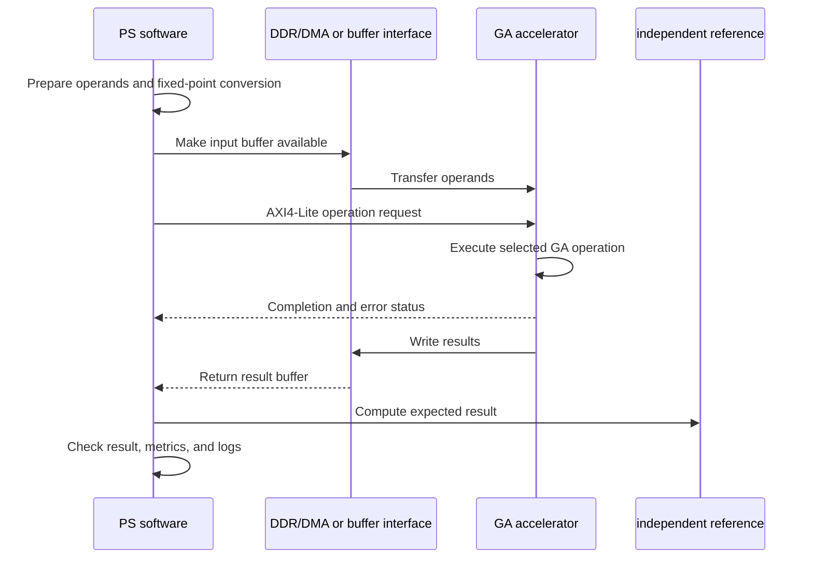

# Hardware transaction flow (proposed)

```mermaid
sequenceDiagram
  participant PS as PS software
  participant MEM as DDR/DMA or buffer interface
  participant PL as GA accelerator
  participant REF as independent reference
  PS->>PS: Prepare operands and fixed-point conversion
  PS->>MEM: Make input buffer available
  MEM->>PL: Transfer operands
  PS->>PL: AXI4-Lite operation request
  PL->>PL: Execute selected GA operation
  PL-->>PS: Completion and error status
  PL->>MEM: Write results
  MEM-->>PS: Return result buffer
  PS->>REF: Compute expected result
  PS->>PS: Check result, metrics, and logs
```

This remains a proposed flow until simulation, synthesis, and physical board
transactions validate each boundary.
