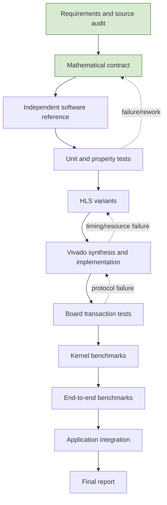

# Development and verification flow

```mermaid
flowchart TD
  R[Requirements and source audit] --> M[Mathematical contract]
  M --> S[Independent software reference]
  S --> T[Unit and property tests]
  T --> H[HLS variants]
  H --> V[Vivado synthesis and implementation]
  V --> B[Board transaction tests]
  B --> K[Kernel benchmarks]
  K --> E[End-to-end benchmarks]
  E --> A[Application integration]
  A --> F[Final report]
  T -. failure/rework .-> M
  V -. timing/resource failure .-> H
  B -. protocol failure .-> V
  R:::current
  M:::current
  classDef current fill:#d9ead3,stroke:#38761d
```

Stages 1–3 are the current scope; reference software and hardware are planned
gates, not completed deliverables.
