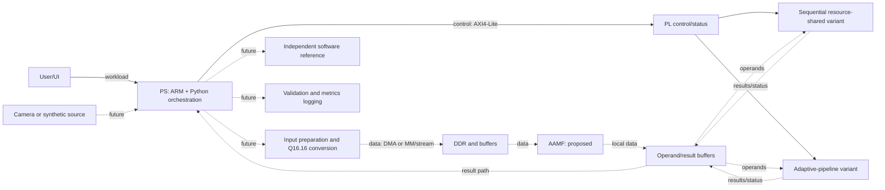

# System architecture (proposed)

```mermaid
flowchart LR
  U[User/UI] -->|workload| PS[PS: ARM + Python orchestration]
  C[Camera or synthetic source] -. future .-> PS
  PS -. future .-> PREP[Input preparation and Q16.16 conversion]
  PS -->|control: AXI4-Lite| CTRL[PL control/status]
  PREP -. data: DMA or MM/stream .-> DDR[DDR and buffers]
  DDR -. data .-> FAB[AAMF: proposed]
  FAB -. local data .-> BUF[Operand/result buffers]
  CTRL --> SEQ[Sequential resource-shared variant]
  CTRL --> PIPE[Adaptive-pipeline variant]
  BUF -. operands .-> SEQ
  BUF -. operands .-> PIPE
  SEQ -. results/status .-> BUF
  PIPE -. results/status .-> BUF
  BUF -. result path .-> PS
  PS -. future .-> REF[Independent software reference]
  PS -. future .-> LOG[Validation and metrics logging]
```

Solid edges indicate the selected system partition; dashed edges are proposed
or unimplemented. Both variants must implement the same mathematical contract.
